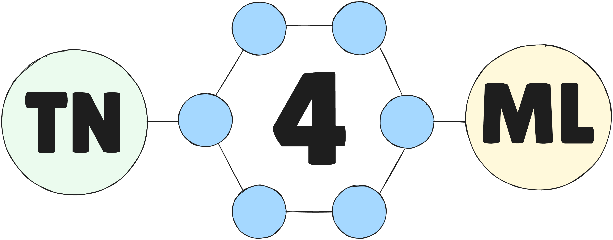

# Tensor Networks for Machine Learning

<br>
**tn4ml** is a Python library that handles tensor networks for machine learning applications.<br>
It is built on top of **Quimb**, for Tensor Network objects, and **JAX**, for optimization pipeline.<br>
For now, the library supports 1D Tensor Network structures: 
- **Matrix Product State**
- **Matrix Product Operator**
- **Spaced Matrix Product Operator**

It supports different **embedding** functions, **initialization** techniques, **objective functions** and **optimization strategies**.<br>

## Installation

First create a virtualenv using `pyenv` or `conda`. Then install the package and its dependencies.
<br>

**With** `pip` (tag v1.0.5):
```bash
pip install tn4ml
```
<br>

or **directly from github**:
```bash
pip install -U git+https://github.com/bsc-quantic/tn4ml.git
```
<br>

If you want to test and edit the code, you can clone the local version of the package and install it.
```bash
git clone https://github.com/bsc-quantic/tn4ml.git
pip install -e tn4ml/
```
If you want to install dependices for *docs*, *test* and *examples*:

```zsh
pip install "tn4ml[docs]"
```
```zsh
pip install "tn4ml[test]"
```
```zsh
pip install "tn4ml[examples]"
```


**Accelerated runtime** <br>

(Optional) To improve runtime precision set these flags:
```python
jax.config.update("jax_enable_x64", True)
jax.config.update('jax_default_matmul_precision', 'highest')
```

**Running on GPU**<br>
Before everything install `JAX` version that supports CUDA and its suitable for runs on GPU.<br>
Checkout how to install here: [jax[cuda]](https://docs.jax.dev/en/latest/installation.html#pip-installation-nvidia-gpu-cuda-installed-via-pip-easier) <br>

Next, at the beginning of your script set:
```python
import os
os.environ["CUDA_VISIBLE_DEVICES"] = "0"  # Use GPU 0 - or set any GPU ID
import jax
jax.config.update("jax_platform_name", 'gpu')
```
Then when training `Model` set:
```python
device = 'gpu'
model.configure(device=device)
```

## Documentation
Visit [tn4ml.readthedocs.io](https://tn4ml.readthedocs.io/en/latest/)

## Example notebooks

[TN for Classification](docs/source/examples/mnist_classification.ipynb)<br>
[TN for Anomaly Detection](docs/source/examples/mnist_ad.ipynb)<br>
[TN for Anomaly Detection with DMRG-like method](docs/source/examples/mnist_ad_sweeps.ipynb)

## Examples from the paper
[Breast Cancer Classification](docs/source/examples/supervised)<br>
[Unsupervised learning with MNIST](docs/source/examples/unsupervised)


## Citation

If you use **tn4ml** in your work, please cite the following paper: [arXiv:2502.13090](https://arxiv.org/abs/2502.13090)

```bibtex
@article{puljak2025tn4mltensornetworktraining,
      title={tn4ml: Tensor Network Training and Customization for Machine Learning}, 
      author={Ema Puljak and Sergio Sanchez-Ramirez and Sergi Masot-Llima and Jofre Vallès-Muns and Artur Garcia-Saez and Maurizio Pierini},
      year={2025},
      eprint={2502.13090},
      archivePrefix={arXiv},
      primaryClass={cs.LG},
      url={https://arxiv.org/abs/2502.13090}, 
      }
```


## License
MIT license - check it out [here](LICENSE)
