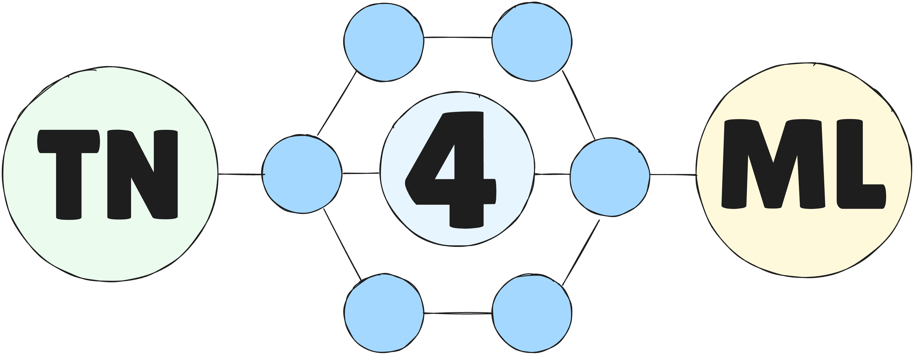

# Tensor Networks for Machine Learning

<br>
**tn4ml** is a Python library that handles tensor networks for machine learning applications. It is built on top of **Quimb**, for Tensor Network objects, and **JAX**, for optimization pipeline.<br>
For now, the library supports 1D Tensor Network structures: **Matrix Product State**, **Matrix Product Operator** and **Spaced Matrix Product Operator**.<br>
It supports different **embedding** functions, **initialization** techniques, and **optimization strategies**.<br>

## Installation

First create a virtualenv using `pyenv` or `conda`. Then install the package and its dependencies.
<br>

**With** `pip` (tag 1.0.2):
```bash
pip install tn4ml
```
<br>

or **directly from github**:
```bash
pip install -U git+https://github.com/bsc-quantic/tn4ml.git
```
<br>

If you want to test and edit the code, you can clone local version of the package and install.
```bash
git clone https://github.com/bsc-quantic/tn4ml.git
pip install -e tn4ml/
```
## Documentation
Visit [tn4ml.readthedocs.io](https://tn4ml.readthedocs.io/en/latest/)

## Example notebooks
There are working examples of **supervised learning** (classification), and **unsupervised learning** (anomaly detection), both on MNIST images.<br>

[TN for Classification](docs/source/notebooks/mnist_classification.ipynb)<br>
[TN for Anomaly Detection](docs/source/notebooks/mnist_ad.ipynb)<br>
[TN for Anomaly Detection with DMRG-like method](docs/source/notebooks/mnist_ad_sweeps.ipynb)

## License
MIT license - check it out [here](LICENSE)
