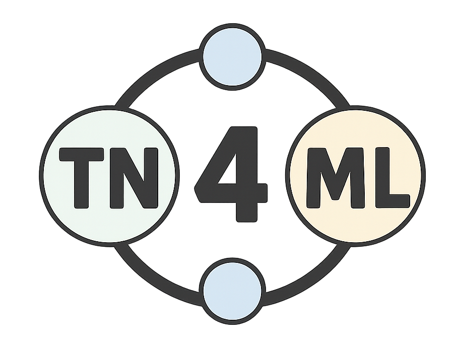

# Tensor Networks for Machine Learning

<br>
**tn4ml** is a Python library that handles tensor networks for machine learning applications. It is built on top of **Quimb**, for Tensor Network objects, and **JAX**, for optimization pipeline.<br>
For now, the library supports 1D Tensor Network structures: **Matrix Product State**, **Matrix Product Operator** and **Spaced Matrix Product Operator**.<br>
It supports different **embedding** functions, **initialization** techniques, and **optimization strategies**.<br>

## Installation

First create a virtualenv using `pyenv` or `conda`. Then install this package using,
```bash
pip install .
```

This will install the package and its dependencies.

## Documentation
Work in progress. Soon.

## Example notebooks
There are working examples of **supervised learning** (classification), and **unsupervised learning** (anomaly detection), both on MNIST images.<br>

[TN for Classification](docs/source/notebooks/mnist_classification.ipynb)<br>
[TN for Anomaly Detection](docs/source/notebooks/mnist_ad.ipynb)<br>
[TN for Anomaly Detection with DMRG-like method](docs/source/notebooks/mnist_ad_sweeps.ipynb)

## License
MIT license - check it out [here](LICENSE)